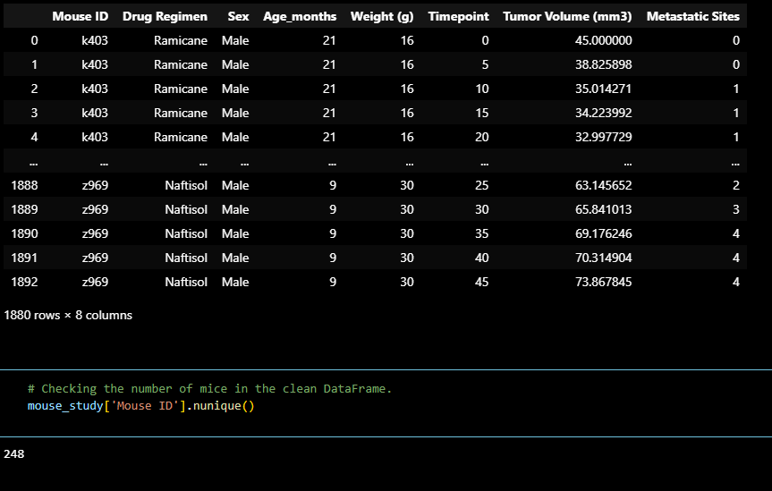
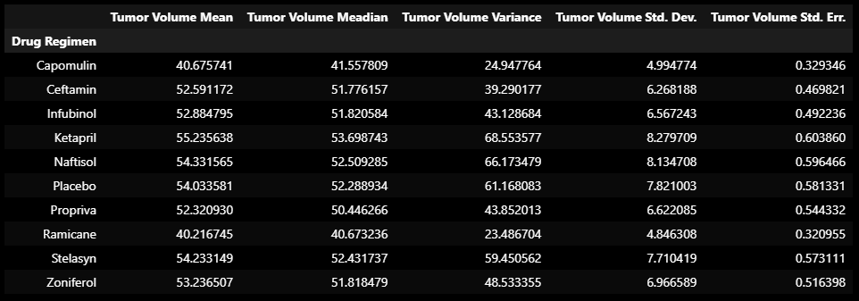
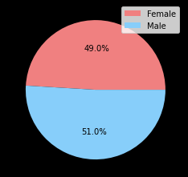
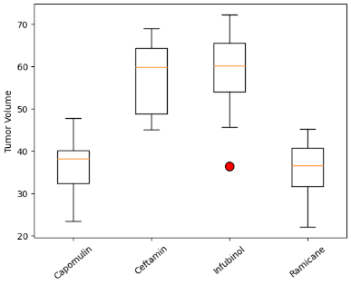
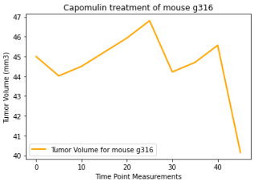
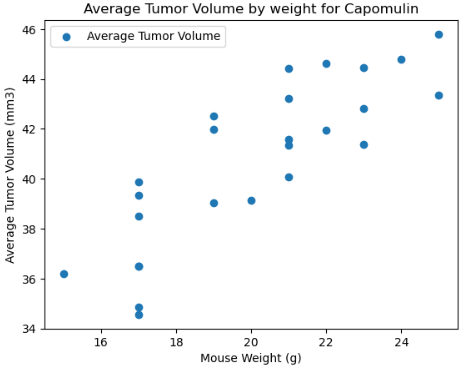
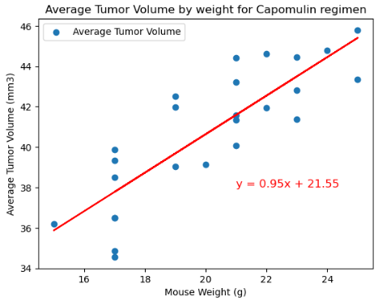

# Module 5 Challenge
In this Repository, you will find the completed Module 5 - Matplotlib Challenge 

# Instructions
This assignment is broken down into the following tasks:

* Prepare the data.
    * To prepare the data, we merged both csv files on the 'Mouse ID' column. After merging, we identified the duplicate mouse ID of 'g989' and were able to drop all duplicates from the data set, resulting in a cleaner dataframe:  
    

* Generate summary statistics.
    * We generated a summary statistics table to show the mean, median, variance, standard deviation, and SEM of the tumor volumes for each drug regimen. To make it easier to analyze, we converted the table into its own dataframe to house this newly gathered information.   
    

* Create bar charts and pie charts.
    * In order to review the data in an easier manner, we created visualizations representing the total number of timepoints for all mice, the distribution of female versus male mice in bar and pie charts.   
       
    

* Calculate quartiles, find outliers, and create a box plot.
    * We were able to calculate quartiles, and found one outlier within the data for the four drug regimens.   
    

* Create a line plot and a scatter plot.
    * We also plotted a line graph for the tumor volume vs. time points using the Capomulin regimen, to track which regimen is most succesful based on how long the mice have been treated. Each time the cell is ran, a new mouse ID will be generated, so the line graph will give a different ID each time.  
    

    * After creating the line graph, we went ahead and also plotted a scatter graph using the Capomulin regimen, based on the average tumor volume versus mouse wieght and noticed that as the mouse weight got heavier, the average tumor volume also increased.   
    

* Calculate correlation and regression.
    * In plotting the scatter plot, we noticed a strong correlation between avg. tumor volume and mouse weight, so we went ahead and calculated the correlation coefficiency and linear regression model for the drug regimen Capomulin. In doing so, we confirmed the strong correlation with an output of 0.84.   
    

# Submit your final analysis.

* The scatter plot shown in the analysis, prortrays a potential association between a mice's weight and size of their tumor, showing that mice of lower wieght finished the regimen with smaller tumors than the heavier mice. There was a very strong positive correlation, with r=0.84.

* The date was further check for any potential outliers, only one outlier was found in Infubinol.

* In looking at the drugs Capomulin and Ramicane, it is seen that these are the most effective drugs for SCC in the study mice.

* It was also observed that if a mouse is given additional days of Capomulin treatment, beyond the 45 days, shrunk the tumor in mouse I509, however, the tumor volume started to go up for other mice, so this may be an inconclusive observation.

edited April 27, 2023

